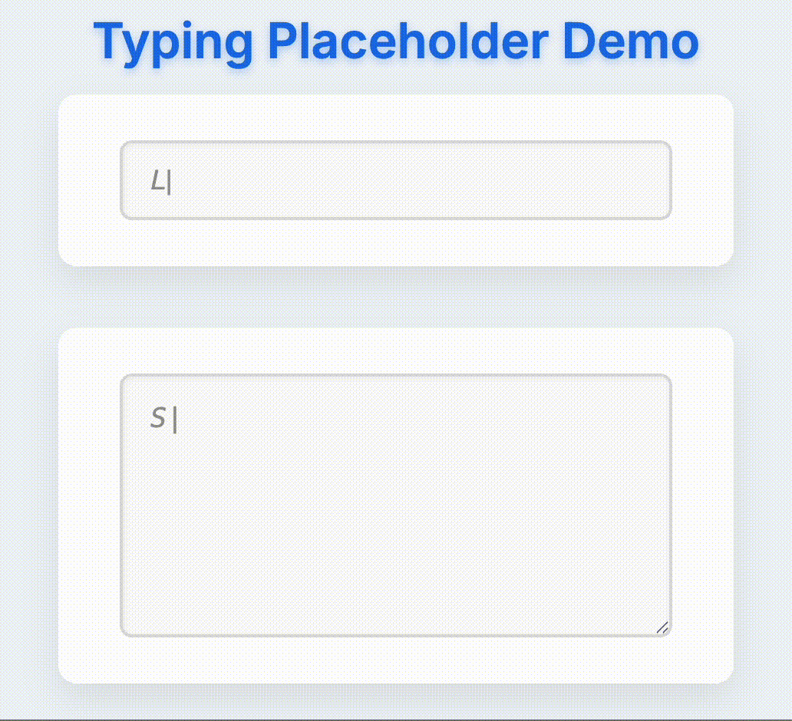

# typing-placeholder-input

> A small library to animate placeholder text with a typing effect for input and textarea elements. Works with both **Vanilla JS** and **React**.


---

## ✨ Features

- Typewriter-like animated placeholder text
- Works with both `<input>` and `<textarea>` elements
- Lightweight and dependency-free core
- React wrapper with full type support
- TypeScript compatible

---

## 📦 Installation

```bash
npm install typing-placeholder-input
# or
yarn add typing-placeholder-input
```

---

## ✨ Demo

<p align="center">
  
</p>

---

## 🚀 Quick Start

### ✅ Vanilla JavaScript

```html
<input id="typer" />
<textarea id="typer-textarea"></textarea>

<script type="module">
  import { PlaceholderTyper } from "typing-placeholder-input";
  // import { PlaceholderTyper } from "https://cdn.jsdelivr.net/npm/typing-placeholder-input/dist/index.js";

  new PlaceholderTyper("#typer", {
    strings: [
      "Looking for inspiration?",
      "Type a keyword: AI, nature, dreams...",
      "Start typing to unlock ideas ✨",
    ],
    speed: 100,
    delayBetween: 1000,
    deleteSpeed: 60,
    loop: true,
    cursor: "|",
  });

  new PlaceholderTyper("#typer-textarea", {
    strings: [
      "Start typing your thoughts here...",
      "A poem, an idea, or just a random note.\nNo pressure, just flow.",
    ],
    speed: 100,
    delayBetween: 1000,
    deleteSpeed: 60,
    loop: true,
    cursor: "|",
  });
</script>
```

### ✅ React

```tsx
import React from "react";
import PlaceholderTyperWrapper from "typing-placeholder-input/react";

function App() {
  return (
    <PlaceholderTyperWrapper
      as="input"
      strings={["Hello", "World", "Start typing..."]}
      speed={100}
      delayBetween={1500}
      deleteSpeed={50}
      loop
      cursor="|"
      className="my-input"
      onChange={(e) => console.log(e.target.value)}
    />
  );
}

export default App;
```

You can also use as="textarea" to render a `<textarea>` instead of an `<input>`.

## 🔧 Props

These options apply to both the vanilla and React version:

| Prop           | Type       | Default  | Description                            |
| -------------- | ---------- | -------- | -------------------------------------- |
| `strings`      | `string[]` | required | The phrases to type                    |
| `speed`        | `number`   | 70       | Typing speed (ms per character)        |
| `deleteSpeed`  | `number`   | 40       | Deleting speed (ms per character)      |
| `delayBetween` | `number`   | 1500     | Delay between strings                  |
| `loop`         | `boolean`  | true     | Whether to loop the typing animation   |
| `cursor`       | `string`   | `""`     | Character to show at the end of typing |

Additionally, the React wrapper supports all native `<input>` or `<textarea>` props.

## 🧪 Examples

### Vanilla Demo

Open `example/vanilla/index.html` in a browser or run:

```bash
npm run example:vanilla
```

### React Demo

Located in `example/react/`, run:

```bash
cd example/react
npm install
npm run dev
```

---

## 🛠 Development

```bash
# Build library
npm run build
```

Uses `vite-plugin-dts` for generating bundled type declarations.

---

## 🧾 License

MIT © [Ismail Aslan](mailto:ismailaslan1097@gmail.com)

---

## 🙌 Feedback / Contributions

PRs and issues welcome. If you use this in your project, I’d love to hear about it!
